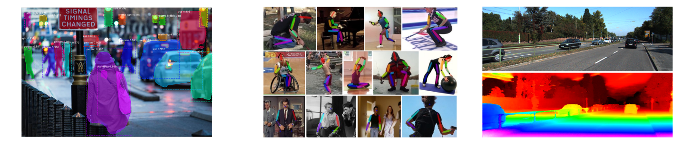
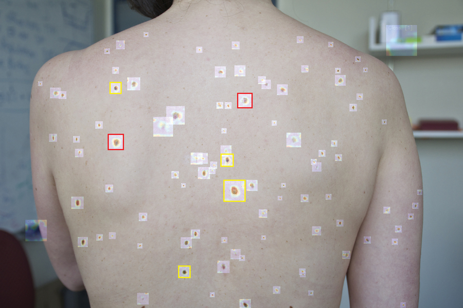
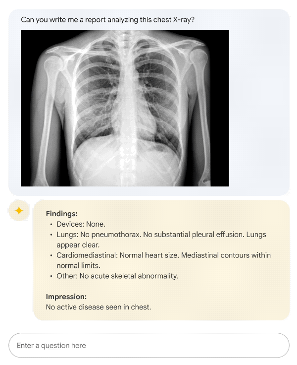
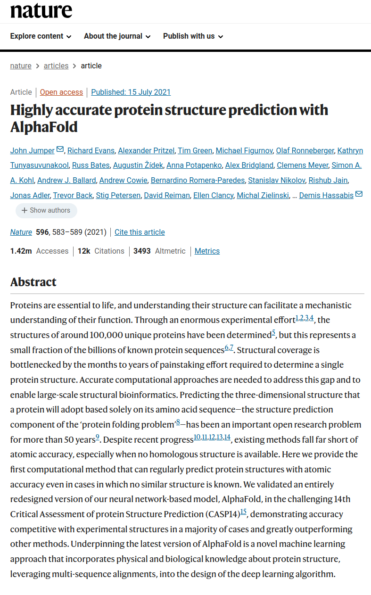

background-image: url(./figures/bg.png)
class: middle, center, title-slide

# Artificial Intelligence:  When algorithms meet medicine

 

Belgian Hematology Society, 39th General Annual Meeting 
February 2, 2024

 

Prof. Gilles Louppe 
[g.louppe@uliege.be](mailto:g.louppe@uliege.be)

---

class: middle

.center.width-40[]

.footnote[Credits: François Fleuret, 2023.]

???

When you start a project in artificial intelligence or machine learning, one of the very first steps, and this is something I keep repeating to my students, is to look at the data. Take the raw data and visualize it.

The data I want to start with today is data related to blood pressure. We have a dataset of 30 patients, with their age and their blood pressure shown as points on the plot. This is a very simple dataset, and the problem is not very interesting in itself, but it is a good example to illustrate how we can use machine learning to make predictions.

Let's start with a simple question: can we predict the blood pressure of a patient based on his or her age?

In other words, can we write a computer program that, given the age of a patient, will make a guess about his or her blood pressure?

---

class: middle
count: false

.width-100[]

.footnote[Credits: François Fleuret, 2023.]

???

The machine learning approach to this problem is not hardcode some made-up computer program that would take the age of a patient and return a blood pressure. Instead, the machine learning approach is to write a computer program that will learn to make predictions by itself, by looking at the data.

---

class: middle
count: false

.width-100[]

.footnote[Credits: François Fleuret, 2023.]

???

To do so, we need to define a model, a mathematical function that will take the age of a patient as input and return a prediction of his or her blood pressure. 

Often, this model is a function with parameters. The parameters are the knobs of the model, and we will tune them to make the best predictions.

The simplest example is the linear model, which is a function of the form `y = ax + b`, where `a` and `b` are the parameters to be learned, the two knobs that we can turn to change the behavior of the model.

To find the best parameter values, we will use the data to train the model. This means that we will show the model the data, make it make predictions, and then adjust its parameters to reduce the error between its predictions and the true blood pressure values.

This process can be described mathematically and implemented in a computer program. This is what we call the training of the model.

---

class: middle
count: false

.width-100[]

.footnote[Credits: François Fleuret, 2023.]

---

class: middle
count: false

.width-100[]

.footnote[Credits: François Fleuret, 2023.]

---

class: middle
count: false

.width-100[]

.footnote[Credits: François Fleuret, 2023.]

---

class: middle
count: false

.width-100[]

.footnote[Credits: François Fleuret, 2023.]

---

class: middle
count: false

.width-100[]

.footnote[Credits: François Fleuret, 2023.]

---

class: middle
count: false

.width-100[]

.footnote[Credits: François Fleuret, 2023.]

---

class: middle

## Deep Learning

Deep learning scales up the statistical and machine learning approaches by
- using larger models known as neural networks,
- training on larger datasets,
- using more compute resources.

.grid[
.kol-3-4.width-70.center[]
.kol-1-4.width-90.center[ ]
]

???

[Talk about the slide first.]

Scaling up the statistical and machine learning approaches by brute force in these three dimensions has been key to the success of deep learning.

---

class: middle

Specialized neural networks can be trained to achieve super-human performance on complex tasks.

.width-100[]

.width-100[]

.center[(Top) Scene understanding, pose estimation, geometric reasoning. 
(Bottom) Planning, Image captioning, Question answering.]

.footnote[Credits: François Fleuret, 2023.]

???

Following this approach, deep learning has been successful in tasks that were previously considered hard for computers, such as understanding images, speech, or text.

In particular, specialized neural networks can be trained to solve a large variety of problems, from scene understanding to geometric reasoning, from planning to question answering.

While these problems can be perceived as artificial and not really important in their own right, they actually form a set of primitive tasks that are found in many domains of application. 

---

class: middle

Immediate applications of specialized neural networks in health and medicine have been around for a while.

.grid[
.kol-1-3.center.width-100[]
.kol-1-3.center.width-80[]
.kol-1-3.center.width-80[]
]
.width-100[]

.center[(Top) Analysis of histological slides, denoising of MRI images, nevus detection. 
(Bottom) Whole-body hemodynamics reconstruction from PPG signals.]

???

For example, in health and medicine, the same specialized neural networks that are used to annotate scenes can be used to analyze biomedical images, such as histological slides.

Specialized neural networks can also be used to denoise MRI images, to detect nevus, or to reconstruct whole-body hemodynamics from PPG signals, if some of you have an Apple Watch.

As a matter of fact, the adoption of AI and deep learning in health and medicine has been growing steadily over the past decade, with many applications in medical imaging, genomics, and many more. 

These applications however, are often deeply embedded in the tools used by healthcare professionals, and are not always visible to the public.

---

class: middle

.grid[
.kol-2-5.center.width-100[]
.kol-3-5.center.width-100[ ]
]

## From large to enormous

Scaling up further to gigantic models, datasets, and compute resources keeps pushing the boundaries of what is possible, .bold[with no sign of slowing down].

???

Meanwhile, research in deep learning has continued at a fast pace, with the development of new models, new algorithms, and new applications.

One of the most important developments in recent years has been the introduction of the transformer architecture.

This architecture has been key to scaling up the size of our models and the amount of data we can use to train them. Today, the largest models count up to hundreds of billions of parameters, and are trained on datasets with hundreds of terabytes of data.

To our surprise, these gigantic models keep pushing the boundaries of what is possible, with no sign of slowing down. Make them bigger, train them on more data, and they keep getting better.

---

class: middle, center
background-color: #343541

<video src="./figures/chatgpt-hema.webm" controls loop muted width=640 height=640></video>

???

The pinnacle of this scaling up has been the development of conversational and generative AI systems. The most famous and successful example being of course OpenAI's ChatGPT.

[play video]

These systems are trained to generate human-like text, and can be used to answer questions, write stories, or even have a conversation with a human.

For example, here is a short conversation with ChatGPT about hematology and what I should know about it, as a non-professional.

These systems keep getting better, the pace of progress is really fast and impressive. For example, the latest versions of those systems are multi-modal, meaning that they can generate not only text, but also images and sounds. 
---

class: middle, center

.center.width-50[]

.center[.bold[Med-PaLM 2] (Google) is a large language model tuned for the medical domain. It reaches 85%+ accuracy on US Medical Licensing Examination-style questions.] 

???

What makes these AI systems really different is that they offer a new interface. AI is no longer embedded in tools but in direct contact with us, humans.

For example, Med-PaLM 2 is a large language model tuned for the medical domain. It can be interacted with using natural language, as if you were talking to a medical expert. 

---

class: middle, center, black-slide

<iframe width="600" height="450" src="https://www.youtube.com/embed/Q-cGhjzJkpI" frameborder="0" allowfullscreen></iframe>

???

I am confident that conversational and generative AI systems will be used more and more in the future, and will have a significant impact on how we interact with computers, and how we access information, including in health and medicine.

For example, Nuance is already using conversational AI to help doctors with their documentation, by listening to patient-doctor conversations and turning them into medical notes. This is a very good example of how AI can be used to automate tasks that are time-consuming and not directly related to patient care.

---

class: middle, center

Deep learning can also .bold[solve problems that no one could solve before].

???

Beyond the basic work that can be automated, the most exciting applications of AI, at least for the scientist in me, is the fact that deep learning can also be used to solve problems that no one could solve before. To make discoveries. 

I have many examples in mind, but I will only mention a few today, to give you a sense of what is possible. I will focus on health and medicine, but the same is true in many other domains.

---

class: middle

## AlphaFold: From a sequence of amino acids to a 3D structure

.grid[
.kol-2-3.center.width-100[]
.kol-1-3.center.width-100[]
]

???

The first example is AlphaFold, a neural network based on the trasnformer architecture that can predict the 3D structure of a protein from its amino acid sequence.

This problem is important because the 3D structure of a protein determines its function, and understanding protein function is key to understanding biology and designing new drugs.

However, determining the 3D structure of a protein experimentally is difficult and expensive, taking up to months just to solve a single structure. 

AlphaFold has been a breakthrough in this area, and has been able to predict the 3D structure of proteins with high accuracy, in just a couple of minutes for the longest sequences.

---

class: middle

## Drug discovery with graph neural networks

.center.width-80[]

???

A second example is the use of graph neural networks to discover new drugs.

Discovering new drugs is a complex and expensive search problem, where the goal is to find molecules that will bind to a target protein and modulate its function. Unfortunately, this problem is difficult for two reasons:
- first, the search space is huge -- the space all possible pharmacologically active molecules is estimated to be in the order of 10^60 molecules.
- second, the binding of a molecule to a protein is a complex process that is difficult to model. Laboratory experiments are necessary to evaluate the binding of a molecule to a protein, and these experiments are expensive and time-consuming.

Graph neural networks have been a breakthrough in this area, and have been able to predict the properties of molecules with high accuracy. 

In a sense, they can serve as a virtual laboratory that can be used to pre-screen millions of molecules in a matter of hours, thereby reducing the laboratory work to only the most promising candidates.

---

class: middle

## Predicting cardiovascular risks from retinal images

.grid[
.kol-1-2.center.width-100[]
.kol-1-2.center.width-100[]
]

???

Finally, a third example is the use of deep learning to predict cardiovascular risks from retinal images.

As I understand it, predicting cardiovascular risks and other factors from retinal fundus photographs was previously considered impossible because no relevant features were believed to be visible in these images. However, a few years ago, a team of researchers from Google showed that it was possible to predict cardiovascular risks from retinal images with high accuracy, using a deep neural network.

Not only this is interesting from a medical perspective, but it also points to the fact that deep neural networks can be used to make discoveries in unexpected places, because of their ability to pick up complex and latent patterns from data that are difficult to understand for humans.

---

class: middle, red-slide

## Limitations

- Neural networks are .bold[black boxes]. Their internal workings are difficult to understand, and their predictions difficult to explain. 
- Certifying the robustness of neural networks is also difficult. How to use them in safety-critical applications, like health and medicine?
- Modern neural networks require .bold[large amounts of data and compute]. The resources required to train and run them can be prohibitive.
- Data is often .bold[biased]. How to ensure that a neural network will not reproduce these biases?

???

In a domain as critical as health and medicine, however, I must stress that deep neural networks are not perfect. They have limitations that must be taken into account.

---

background-image: url(./figures/bg.png)
class: middle

## Summary

- Deep neural networks learn to solve complex tasks by themselves, given enough data and compute.
- They are already used in health and medicine, and will be used more and more in the future with the advent of conversational and generative AI systems.
- They are not perfect, and their limitations must be taken into account.
